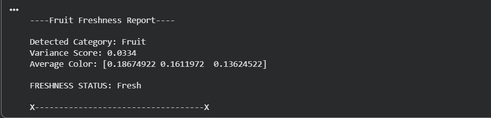
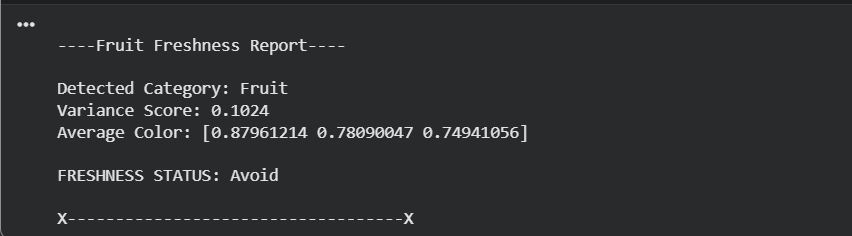
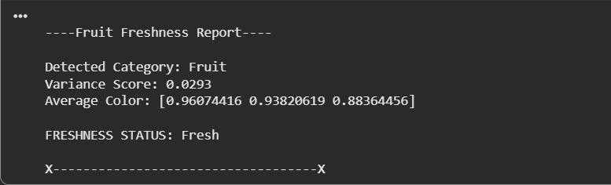

# 🍎 Fruit Freshness Detector (Prototype)

## 📌 Overview

Fruit Freshness Detector is a prototype computer vision project that estimates the freshness of fruit images using image variance analysis.

The system first identifies whether the uploaded image belongs to the fruit category using a Zero-Shot Image Classification model from Hugging Face. Once a fruit is detected, the image is analyzed using statistical image features to estimate its freshness level.

The project was developed as a learning-focused AI and Computer Vision prototype to explore image classification, feature extraction, and rule-based decision making.

---

## 🎯 Project Objective

The primary objectives of this project are:

- Detect whether an uploaded image contains a fruit.
- Extract visual features from the image.
- Estimate fruit freshness using image variance.
- Generate a simple freshness report.
- Explore the practical application of computer vision techniques.

---

## 🛠 Technologies Used

- Python
- Google Colab
- Hugging Face Transformers
- Zero-Shot Image Classification
- NumPy
- Pillow (PIL)

---

## 🔄 Project Workflow

```text
Image Upload
      ↓
Fruit Classification
      ↓
Variance Calculation
      ↓
Freshness Estimation
      ↓
Freshness Report
```

---

## 📸 Sample Outputs

### Fresh Apple Detection



### Rotten Apple Detection



### Fresh Banana Detection



---

## 🧠 Methodology

### 1. Fruit Classification

The uploaded image is passed through a Hugging Face Zero-Shot Image Classification model.

Candidate labels:

- Fruit
- Vegetable
- Baked
- Meat
- Dairy

Only images classified as **Fruit** proceed to freshness analysis.

---

### 2. Feature Extraction

The image is converted into a NumPy array and normalized.

Variance is calculated from the pixel values:

```python
variance = np.var(img_array)
```

Variance measures the spread of pixel intensities within an image.

---

### 3. Freshness Estimation

Freshness is determined using predefined variance thresholds.

| Variance Range | Freshness |
|---------------|------------|
| Less than 0.04 | Fresh |
| 0.04 - 0.08 | Okay |
| Greater than 0.08 | Avoid |

---

## 📊 Test Results

| Fruit | Condition | Variance | Prediction |
|---------|---------|---------|---------|
| Apple | Fresh | 0.033 | Fresh |
| Apple | Rotten | 0.102 | Avoid |
| Banana | Fresh | 0.029 | Fresh |
| Banana | Rotten | 0.081 | Avoid |
| Orange | Fresh | 0.069 | Okay |
| Orange | Rotten | 0.102 | Avoid |
| Grapes | Fresh | 0.070 | Okay |
| Pear | Fresh | 0.053 | Okay |
| Pear | Rotten | 0.072 | Okay |

---

## 📈 Key Observations

During testing, the system performed well for:

- Apples
- Bananas

The system showed mixed results for:

- Pears
- Grapes
- Oranges

This demonstrates that image variance can be useful for freshness estimation but is not sufficient as a standalone feature for all fruit types.

---

## ⚠️ Limitations

- Prototype-level implementation.
- Supports fruit freshness estimation only.
- Relies solely on image variance.
- Performance depends on image quality and lighting conditions.
- Different fruit textures affect variance values.
- Not intended for commercial deployment.

---

## 🚀 Future Improvements

Potential future enhancements include:

- Training a CNN-based Fresh vs Rotten classifier.
- Using a dedicated fruit freshness dataset.
- Adding support for vegetables.
- Combining multiple image features instead of variance alone.
- Building a Streamlit web application.
- Deploying the project on the cloud.

---

## 📚 Learning Outcomes

This project helped in understanding:

- Computer Vision Fundamentals
- Image Classification
- Feature Extraction
- NumPy Image Processing
- Hugging Face Transformers
- Rule-Based Classification Systems
- Model Evaluation and Testing

---

## 💡 Conclusion

This project successfully demonstrates a prototype approach for fruit freshness estimation using image classification and variance-based analysis.

Although the model has limitations, it serves as a strong proof-of-concept and provides valuable insights into computer vision workflows, image processing, and AI-based decision making.

---

## 👨‍💻 Author

**Prayansh Gupta**

B.Tech – Artificial Intelligence & Data Science

Galgotias College of Engineering & Technology (2023-27)

Prototype project developed for learning and experimentation in Computer Vision and Artificial Intelligence.
